<div align="center">
  

  <br/><br/>

  [](https://www.python.org/)
  [](https://www.postgresql.org/)
  [](https://streamlit.io/)
  [-2EA44F?style=for-the-badge&logo=pytest&logoColor=white)](https://docs.pytest.org/)
  [](LICENSE)

  <p align="center">
    <strong>Plataforma de Engenharia de Dados, Modelagem Dimensional, Inteligência Preditiva e Visual Analytics</strong><br/>
    Desenvolvida para a empresa de varejo náutico multicanal <strong>LH Nautical</strong>.
  </p>
</div>

---

## 📌 1. Visão Geral da Arquitetura

O projeto integra a jornada completa de dados da empresa a partir de **24 entidades relacionais do ERP (433.424 registros)** cobrindo o período transacional de **2020 a 2026**:

```
                                ARQUITETURA DE DADOS LH NAUTICAL
┌──────────────────────┐      ┌────────────────────────┐      ┌────────────────────────┐
│   24 CSVs Brutos     │ ───► │  Inferência DDL / SQL  │ ───► │  Analytics & Modelos   │
│   (data/raw/*.csv)   │      │  (Python Puro Stdlib)  │      │  (Séries & RecSys)     │
└──────────────────────┘      └────────────────────────┘      └────────────────────────┘
                                                                           │
                                                                           ▼
                                                              ┌────────────────────────┐
                                                              │ Dashboards & Notebooks │
                                                              │ (Streamlit / HTML / NB)│
                                                              └────────────────────────┘
```

---

## 📁 2. Estrutura do Repositório

```text
lh_nautical/
├── data/
│   ├── raw/                 # 24 arquivos CSV brutos do ERP náutico
│   └── processed/           # Gráficos analíticos e artefatos de dados
├── src/
│   ├── 0_eda_orders.py      # Auditoria transacional e análise descritiva (EDA)
│   ├── 1_gerar_schema.py    # Gerador de DDL PostgreSQL em Python puro (stdlib)
│   ├── 2_carregar_dados.py  # Ingestão de dados e validação de volumetria
│   ├── 4_modelo_demanda.py  # Modelagem preditiva baseline de demanda (Média Móvel 3M)
│   ├── 5_sistema_recomendacao.py # Motor de recomendação item-item (Cosine Similarity)
│   ├── gerar_todos_graficos.py   # Gerador de gráficos analíticos em alta resolução
│   └── gerar_notebook.py    # Construtor e executor do Jupyter Notebook
├── sql/
│   ├── schema.sql           # DDL completo das 24 tabelas relacionais (PostgreSQL 16)
│   ├── 3_analise_sql.sql    # Queries analíticas (Clientes Fiéis e Dimensão Calendário)
│   ├── q4_clientes_fieis.sql# Query modular de clientes VIP e categorias
│   └── q5_calendario_pos.sql# Query modular de série temporal e vendas presenciais
├── notebooks/
│   └── analise_e_modelagem_lh_nautical.ipynb # Notebook executivo com saídas renderizadas
├── dashboard/
│   ├── app.py               # Aplicação interativa em Streamlit (5 abas analíticas)
│   ├── dashboard_lh_nautical.html # Dashboard standalone autônomo (HTML5 + Chart.js)
│   └── README.md            # Documentação da suite de dashboards
├── tests/
│   ├── conftest.py          # Fixtures e configurações do Pytest
│   ├── test_data_integrity.py     # Testes de integridade volumétrica e estatística
│   ├── test_schema_generation.py  # Teste de conformidade estrita do gerador DDL
│   └── test_models_and_analytics.py # Testes matemáticos de ML e séries temporais
├── requirements.txt         # Dependências do ecossistema Python
└── .gitignore               # Configuração de arquivos ignorados no versionamento
```

---

## ⚙️ 3. Configuração do Ambiente

### Pré-requisitos
- Python 3.12+
- Git

### Instalação

```bash
# 1. Clone o repositório
git clone https://github.com/lucenfort/lh_nautical.git
cd lh_nautical

# 2. Crie e ative o ambiente virtual
python3 -m venv .venv
source .venv/bin/activate  # Linux/macOS
# .venv\Scripts\activate   # Windows

# 3. Instale as dependências
pip install --upgrade pip
pip install -r requirements.txt
```

---

## 🚀 4. Execução dos Componentes

### 4.1 Execução de Testes Automatizados
```bash
pytest -v
```

### 4.2 Execução dos Scripts Analíticos
```bash
# Análise exploratória inicial (EDA)
python3 src/0_eda_orders.py

# Geração do schema PostgreSQL DDL (Python puro)
python3 src/1_gerar_schema.py

# Ingestão e conferência volumétrica
python3 src/2_carregar_dados.py

# Modelo preditivo de demanda (Bússola de Bordo 702)
python3 src/4_modelo_demanda.py

# Sistema de recomendação (Motor de Popa 1949)
python3 src/5_sistema_recomendacao.py
```

### 4.3 Visualização do Dashboard Interativo (Streamlit)

```bash
streamlit run dashboard/app.py
```
Acesse no navegador: `http://localhost:8501`

### 4.4 Execução do Jupyter Notebook
```bash
jupyter notebook notebooks/analise_e_modelagem_lh_nautical.ipynb
```

---

## 📜 Créditos & Conjunto de Dados

Os **24 arquivos CSV brutos** (`data/raw/*.csv`) que compõem a base relacional do ERP fictício da *LH Nautical* foram disponibilizados pela **Indicium** para o Desafio Prático do **Programa Lighthouse** (Programa Trainee em Dados, IA e Negócios Tech). Toda a modelagem relacional, inferência de DDL, pipelines de engenharia, modelos preditivos, suíte de testes e visual analytics foram integralmente desenvolvidos pelo autor.

---

## 👨‍💻 Autor

- **Luciano Silva de Arruda**
- Repositório Oficial: [`https://github.com/lucenfort/lh_nautical`](https://github.com/lucenfort/lh_nautical)

